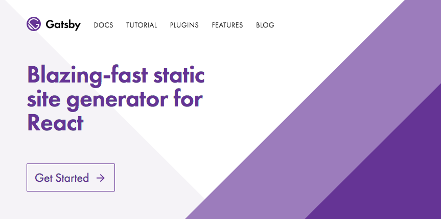
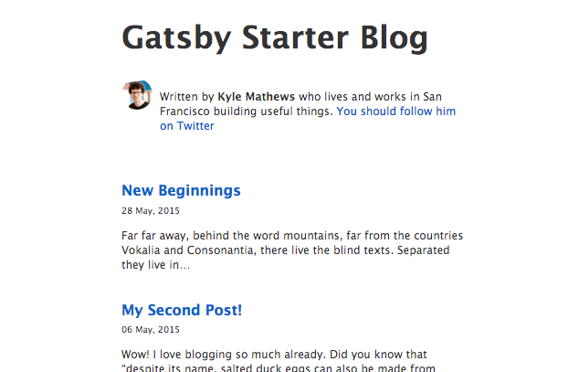

This site runs on [Gatsby](https://gatsbyjs.com), the open source static website generator
that just recently [became a venture backed company](https://www.gatsbyjs.org/blog/2018-05-24-launching-new-gatsby-company/) and I'm liking it a lot. Look, this is just the third CMS I have used in my _whole life_ so it's kinda big deal. My first blog, around 2003, was done in [Movable Type](https://www.movabletype.org/) 2 and I only switched to WordPress in 2006.

WordPress was not only my CMS of choice, it also became a good chunk of my livelihood so the decision of switching to something else did not come easy. But all my research indicates that static web builders are the future and Gatsby seems to be the best choice for my needs.

Still, it wasn't exactly easy to get this site to a point where I'm satisfied with the end-product. My guess is that other people may be in the same position I was, so, here are some things I learned in my journey to Gatsby that may be helpful to others.



## Don't start from scratch

Gatsby is written in JavaScript and it works thanks using a combination of a many cutting-edge technologies. The stack is so hip that it sounds like somebody's making a parody of the modern web stack: Node, React, Webpack, Babel, ES6, GraphQL, plus Markdown and CSS-in-js for a blog like the one you're reading. I think these technologies are great --I even work with most of them on a daily basis!--, but I think it can get very overwhelming very fast.

So, if you want to build a blog, your first instinct may be to [follow a tutorial like this](https://medium.freecodecamp.org/how-to-build-a-react-and-gatsby-powered-blog-in-about-10-minutes-625c35c06481). Don't bother. Instead, use [Gatsby's official starter blog](https://github.com/gatsbyjs/gatsby-starter-blog).

Now, both the design and structure of the starter blog are very opinionated and it can be hard to find how to customize it. Don't panic. I will teach you how.

## Get a base style to your liking.

If you're from the old school, like me, the first thing you'll want to do is find the master CSS file to `cmd+a` and `delete` everything and start your design from scratch. Spoiler alert: You'll not find a single CSS file in your Gatsby installation.

The styles you see on screen will come from two places: either from a package called [typography.js](https://kyleamathews.github.io/typography.js/) or from inline style definitions. I know. Breath. Don't get angry. This is 2018 and kids these days like to put their CSS in their JS. Stay with me and I'll show you that it ain't so bad.

So, first things first, open the `src/utils/typography.js` file and see that it's importing something called `Wordpress2016` (don't tell Matt about that lowercase p) from a package called `typography-theme-wordpress-2016`. If you [look at that package contents](https://github.com/KyleAMathews/typography.js/blob/master/packages/typography-theme-wordpress-2016/src/index.js) you'll see that it's a configuration object for the typography.js plugin. What that means is that this file **determines the global styles for your site**.

If you just don't like this theme, there's a number of oficially maintained [ones you can chose from](https://github.com/KyleAMathews/typography.js/tree/master/packages). For example, if you're feeling retro you can just install a theme inspired in the old [Kubrick WP theme](http://binarybonsai.com/kubrick/).

Install it using npm:

```
npm install --save typography-theme-wordpress-kubrick
```

Then import that package from the `src/utils/typography.js` instead.

```javascript
import Typography from 'typography';
// import Wordpress2016 from 'typography-theme-wordpress-2016'
import Wordpress2016 from 'typography-theme-wordpress-kubrick';
```

Restart your server and voila, you're in 2006.



Of course, you can write your own theme and just import from inside your project. That's what I did.

```javascript
import Typography from 'typography';
import Wordpress2016 from '../theme';
```

And [here's my theme's source](https://github.com/soska/soska.github.com/blob/develop/src/utils/theme.js), in case somebody wants it.

Remember, customizing this file will only affect your global base styles.

## Take control of your fonts.

If you like Google's webfonts, Typography.js has this very nice feature were you can tell it which fonts you'll like to use and it will do all the `@font-face` enchanments for you. Just declare a googleFonts property in your theme with the name of the font you want and the variants you need.

```javascript
  // ...rest of theme object
  googleFonts: [
    {
      name: 'Noto Serif',
      styles: ['400', '400i', '700'],
    },
  ],
  // ...more object configs
```

One more thing: for some reason, the `blog-starter` author didn't want to use this feature, but you can go against his will and comment or delete this line in `src/utils/typography.js`.

```javascript
delete Wordpress2016.googleFonts;
```

Restart your server and you'll be able to use the google fonts in your theme or in your component styles.

## Embrace CSS-in-JS

At first, I tried to go against the current and just use a stylesheet like the good old times when we were young and The Big Bang Theory was still funny. And you know what? Not worth it.

The funny thing is that I've used almost every CSS-in-JS library for react ([JSS](https://github.com/cssinjs/jss),[Radium](https://formidable.com/open-source/radium/), [StyledComponents](https://github.com/styled-components/styled-components), [Glamourous](https://github.com/paypal/glamorous)) in one way or another for apps in the past, but somehow it felt wrong within a content site. That's old man nonsense.

By default, your Gatsby installation will be using React's `style` property to customize components. For example, take a look into the header component defined in `src/layouts/index.js`:

```javascript
<h1
  style={{
    ...scale(1.5),
    marginBottom: rhythm(1.5),
    marginTop: 0,
  }}
>
  <Link
    style={{
      boxShadow: 'none',
      textDecoration: 'none',
      color: 'inherit',
    }}
    to={'/'}
  >
    Gatsby Starter Blog
  </Link>
</h1>
```

The problem with this approach is that when the components are rendered in the browser, those style objects will become inline styles and that's not only disgusting it's also very limiting. For example, you can't define a `:hover` state for that link using inline styles.

There are Gatsby plugins to use almost any one of the css-in-js libraries I listed above, but I would recommend you to go with [Glamor](https://github.com/threepointone/glamor). The way Glamor works is that it replaces the default `JSX` pragma with it's own and that allows it to provide a `css` property to every component.

On the surface, this `css` property looks just like `style`, but behind the scenes Glamor uses some magic to generate actual stylesheets that are injected dynamically into your code. So that file above can become like this:

```javascript
<h1
  css={{
    ...scale(1.5),
    marginBottom: rhythm(1.5),
    marginTop: 0,
  }}
>
  <Link
    css={{
      boxShadow: 'none',
      textDecoration: 'none',
      color: 'inherit',
      '&:hover': {
        color: 'rebeccapurple',
        textDecoration: 'underline',
      },
    }}
    to={'/'}
  >
    Gatsby Starter Blog
  </Link>
</h1>
```

As you can see, it's pretty much the same as before, except that now I can add the `:hover` pseudo-class using a syntax that is very familiar to users of css pre-processors like [Sass](https://sass-lang.com/) or [Less](http://lesscss.org/).

To use Glamor in your Gatsby installation [follow the official instructions here](https://www.gatsbyjs.org/docs/glamor/).

## (Ab)Use React

I must confess that when I first heard about Gatsby and how it used React to generate static websites I rolled my eyes like a teenager being asked by his dad to explain Snapchat. But, it's not that weird if you think of React as the succesor of PHP.

One of the great things about WordPress is that underneath the slick blogging UI it is kind of a PHP framework and if you know a) how to write PHP and b) how to plug into WordPress hooks, you could do almost anything you can imagine.

Same with Gatsby and React. Except that, in Gatsby-land, the line that divides content from code is a blurred one.

I am, for example, very proud of [my projects page](/projects) which, since I already know React, was very fun to make and it can be unique and special, not just a glorified blog post.

## The bad.

Not to end with a negative note, but to be honest, I think that the big problem with Gatsby is that it's not beginner-friendly at all and that the barrier to entry is rather high.

Myself, I have ~10 years of experience as a web developer, I do React and Node for a living and yet much of Gatsby feels like a mystic black-box.

Still, I like the result it produces and the recent investment makes me confident that this is something I want to keep learning. I don't know, maybe I'll get to know it as intimately as I used to know WordPress.

---

I hope this tips are useful, and if you have any comments or found a typo (English is not my first language)you can [find me on Twitter](https://twitter.com/soska) or drop me a line to arm.sosa[at]gmail.com.
