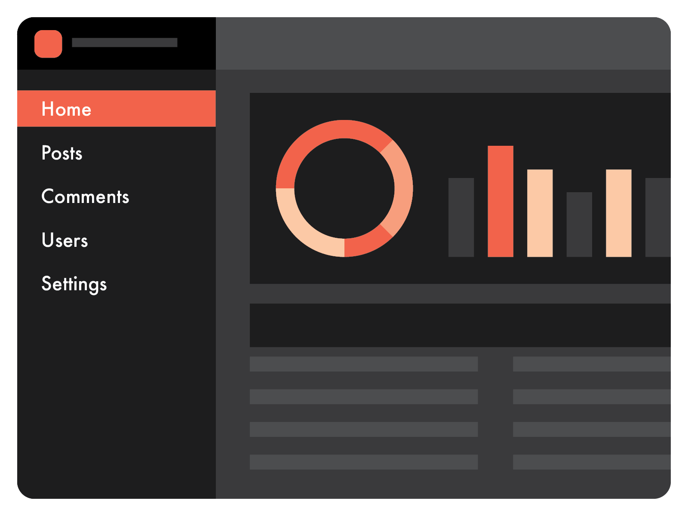

[Last week I presented you](/2018/6/4/keyboardist/) with [React Keyboardist](https://github.com/soska/react-keyboardist) and based on the feedback I received, looks like haven't been very good at explaining the value-proposition of this project, so I remember something I did for a small internal project and thought to show it to you.



So, if you think of your typical admin dashboard application, you'll most likely have a sidebar with links pointing to the various part of your objects. If you use React-Router, you would do the routes part like this:

```javascript
import { BrowserRouter as Router, Route, NavLink } from 'react-router-dom';

const Dashboard = () => (
  <Router>
    <div className="dashboard">
      <div className="sidebar">
        <nav>
          <ul>
            <li>
              <NavLink path="/">Home</NavLink>
            </li>
            <li>
              <NavLink path="/posts">Posts</NavLink>
            </li>
            <li>
              <NavLink path="/comments">Comments</NavLink>
            </li>
            <li>
              <NavLink path="/users">Users</NavLink>
            </li>
            <li>
              <NavLink path="/settings">Settings</NavLink>
            </li>
          </ul>
        </nav>
      </div>

      <div className="main">
        <Route exact path="/" component={Home} />
        <Route path="/posts" component={Posts} />
        <Route path="/comments" component={Comments} />
        <Route path="/users" component={Users} />
        <Route path="/settings" component={Settings} />
      </div>
    </div>
  </Router>
);
```

What if, let's say, you wanted to give special abilities to you power users, like letting them navigate trough the different parts of your dashboard using their keyboard instead of their mouse?. Like, for example, they could press the letter <kbd>P</kbd> to go to `/posts`, <kbd>C</kbd> to go to `/comments` and so on.

And what if we could do that by just declaring a property on our `Route` component?

Well, using `React-Keyboardist`, it is possible to create a drop-in replacement for `Route` that is enhanced with amazing keyboard super powers.

```javascript
import React, { Fragment } from 'react';
import Keyboardist from 'react-keyboardist';

// we'll need the `withRouter` HOC so our component can access the router history
import { Route, withRouter } from 'react-router-dom';

// let's create a mutant Route with enhanced keyboard abilities
const KeyboardRoute = ({ keyName = null, history, ...props }) => {
  // if there's no keyName argument, let's just pass down the regular `Route`
  // this allows to use this component as a drop-in replacement for `Route`
  if (keyName === null) {
    return <Route {...props} />;
  }

  // let's create the binding object to pass to React-Keyboardist
  const bindings = {
    [keyName]: () => {
      // this does all the magic.
      history.push(props.path);
      // by returning false we stop propagation
      return false;
    },
  };

  // and that's it.
  return (
    <Fragment>
      <Keyboardist bindings={bindings} />
      <Route {...props} />
    </Fragment>
  );
};

export default withRouter(KeyboardRoute);
```

And now you can replace each `Route` component with `KeyboardRoute` and assing a key to each route using the `keyName` property.

```javascript
<div className="main">
  <KeyboardRoute exact path="/" component={Home} keyName="keyH" />
  <KeyboardRoute path="/posts" component={Posts} keyName="keyP" />
  <KeyboardRoute path="/comments" component={Comments} keyName="keyC" />
  <KeyboardRoute path="/users" component={Users} keyName="keyU" />
  <KeyboardRoute path="/settings" component={Settings} keyName="keyS" />
</div>
```

In case that you find this useful, the code [is both on Github](https://github.com/soska) and published on npm. I also [made a cute demo](https://soska.github.io/react-router-plus-keyboardist/), so you can see it in action.

```
npm install --save react-router-plus-keyboardist
```

Let me know if you found this useful or if you catch any errors. I'm [@soska on Twitter](https://twitter.com/soska).
