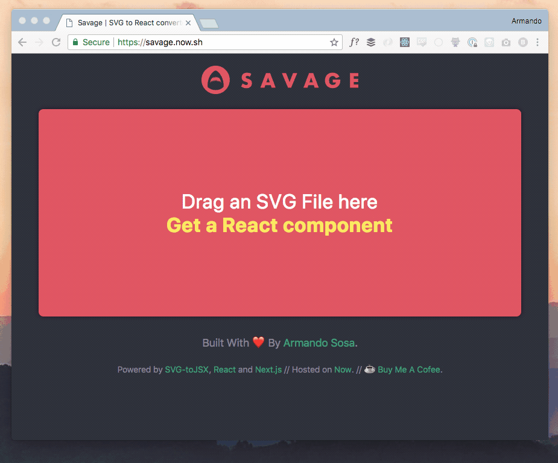

See, kids, back in my days you needed to use images to do all kind of things that today can be accomplished using CSS only. Round corners? Drop shadows? Equal size columns? Fancy font for your header? Yep. We used iamges for all that.

Nowadays I try to avoid using images as much as possible. Sometimes, though, you'll need to put a logo or an icon on a page. In those cases I'll try to use an SVG vector file instead of a raster file.

I like to inline small SVGs whenever possible (sacrifice caching to save http requests) and since pretty much everything I do is built using React, [I made a tool to convert SVG files into React components](https://savage.now.sh).

It's called [Savage](https://savage.now.sh) ("SaVaGe" got it?) and it actually is a little bit more than a hacky UI that replaces a manual process involving [svg-to-jsx](https://github.com/janjakubnanista/svg-to-jsx) and copy-pasting.

And of course, the code is kinda messy, but [it is open source](https://github.com/soska/savagejsx).

If you find this useful in any shape or form, [let me know on Twitter](https://twitter.com/soska)
